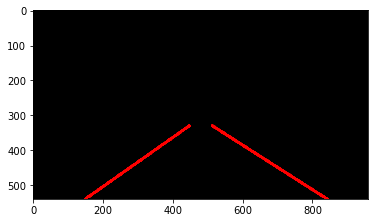

# **Finding Lane Lines on the Road** 

### Reflection

### 1. Describe your pipeline. As part of the description, explain how you modified the draw_lines() function.

My pipeline consisted of 6 steps.
1. Convert to grayscale

2. Canny Edge detection

3. Dilation to smooth edges

4. Mask region of interest

5. Hough transform
6. Linear regression on Hough lines

7. Weigh combined image with lane lines overlay

In order to draw a single line on the left and right lanes, I modified the draw_lines() function by taking the lines output from the Hough transform and finding the slope for each line.  I then used the slope (positive or negative) to determine if each line was from the left lane or the right lane and filled arrays with their respective points.  I also set a high and a low threshold for the slope values to eliminate outliers.  I then ran a linear regression on each set of points (left and right) and used the resulting coefficients to create a best fit line to overlay onto the image.

### 2. Identify potential shortcomings with your current pipeline

One potential shortcoming would be what would happen when the laneline becomes less defined because of lighting (going through shade, etc), markings, or other external factors.  There is an instance in the yellow lane line video where the line projects incorrectly for a short period of time.

Another shortcoming could be if the lane lines moved out of the region of interest as they would then get masked out and detection would fail.

The pipeline doesn't do well at all in the challenge video and even fails to register any lane lines once the road color changes to a lighter gray.

### 3. Suggest possible improvements to your pipeline

A possible improvement would be to make the pipeline more robust by less hardcoding of things like the region of interest vertices, slope thresholds, parameters for Canny/Hough/etc.

Another potential improvement could be to use knowledge of lane line positioning from previous frames in cases where the lane line detection fails for a few frames.

Additional modification of parameters might be needed to pick up lanes where the contrast between the line and the road is less.  Another option here would be to take the original image and find the yellow lines and turn these white so that they would appear stronger in the grayscale transformation.
